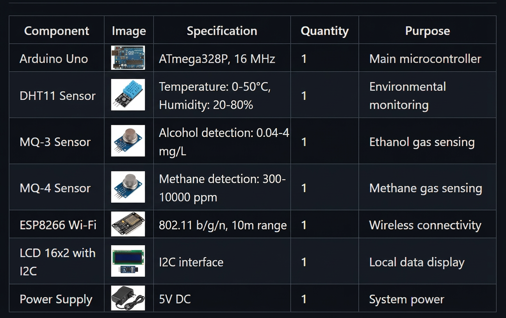
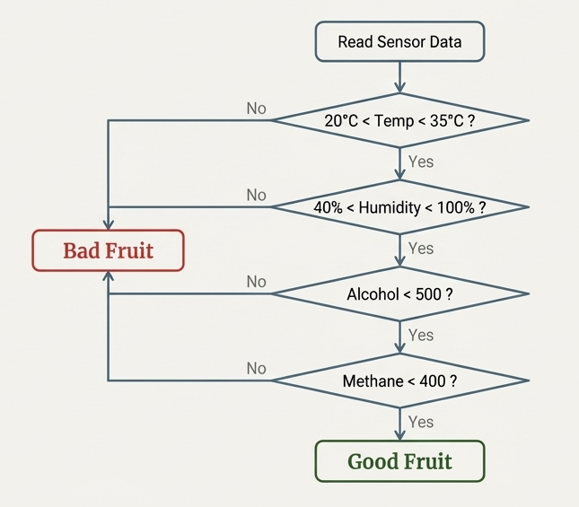

[](https://choosealicense.com/licenses/mit/)
[](https://www.arduino.cc/)
[](https://thingspeak.com/)

Monitor fruit freshness in real-time using sensors and IoT. Detects spoilage through temperature, humidity, and gas levels.


## 🔧 Hardware Components

## 💻 Software Requirements

- **Arduino IDE** (version 1.8+)
- **Libraries**:
  - DHT.h (DHT sensor library)
  - Wire.h (I2C communication)
  - LiquidCrystal_I2C.h (LCD display)
  - ESP8266WiFi.h (Wi-Fi connectivity)
  - ThingSpeak.h (IoT platform integration)
  - SPI.h (SPI communication)


## 💾 Installation

### Hardware Setup

1. **Connect DHT11 Sensor**:
   - VCC → 5V
   - GND → GND
   - Data → Digital Pin 2

2. **Connect MQ-3 Sensor**:
   - VCC → 5V
   - GND → GND
   - Analog Out → A0

3. **Connect MQ-4 Sensor**:
   - VCC → 5V
   - GND → GND
   - Analog Out → A1

4. **Connect ESP8266**:
   - VCC → 3.3V (Important: Do NOT use 5V)
   - GND → GND
   - TX → RX (Arduino)
   - RX → TX (Arduino)

5. **Connect LCD with I2C**:
   - VCC → 5V
   - GND → GND
   - SDA → A4
   - SCL → A5

### Software Setup

1. Install Arduino IDE
2. Install required libraries via Library Manager
3. Configure Wi-Fi credentials in code:
   ```cpp
   const char* ssid = "your_wifi_ssid";
   const char* password = "your_wifi_password";
   ```
4. Set up ThingSpeak channel and API key
5. Upload code to Arduino Uno

## 🚀 Usage

1. Power on the system
2. Wait for Wi-Fi connection (indicated on LCD)
3. Place fruits in the monitored environment
4. System will:
   - Read sensor data every 10 seconds
   - Display readings on LCD
   - Upload data to ThingSpeak
   - Assess fruit quality
   - Display "Good Fruit" or "Bad Fruit" based on thresholds

## 🔍 How It Works



### Data Flow

1. Arduino reads all sensors
2. Data displayed on LCD:
   - Temperature, Humidity
   - Alcohol level, Methane level
   - Quality status
3. ESP8266 transmits data to ThingSpeak
4. ThingSpeak updates fields:
   - Field 1: Temperature
   - Field 2: Humidity
   - Field 3: Alcohol (MQ-3)
   - Field 4: Methane (MQ-4)


## 📊 ThingSpeak Integration

ThingSpeak provides cloud-based data storage and visualization:

1. Create ThingSpeak account
2. Create new channel with 4 fields
3. Obtain Write API Key
4. Configure in Arduino code:
   ```cpp
   const unsigned long channelNumber = YOUR_CHANNEL_NUMBER;
   const char* apiKey = "YOUR_API_KEY";
   ```
5. Data updates every 10 seconds
6. View real-time graphs on ThingSpeak dashboard

## 🏆 Results


## ✅ Advantages

1. **Real-time Monitoring**: Continuous tracking prevents spoilage
2. **Remote Access**: Monitor from anywhere via internet
3. **Predictive Analytics**: Historical data helps predict quality degradation
4. **Quality Assurance**: Maintains optimal storage conditions
5. **Cost-Effective**: Affordable components and open-source software
6. **Automation**: Reduces manual monitoring effort
7. **Traceability**: Complete record of environmental conditions

## 🔮 Future Scope

- Integration with GSM module for SMS alerts
- Machine learning for improved quality prediction
- Mobile app for enhanced user experience
- Multi-chamber monitoring support
- Integration with refrigeration control systems
- Support for different fruit types with custom thresholds
- Miniaturization for portable use
- Battery backup for continuous operation


